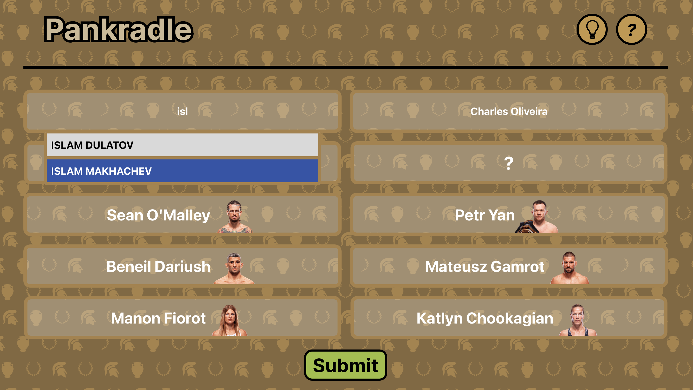

#Pankradle

A daily UFC PPV guessing game inspired by Wordle.

## How It works
Each day presents itself with a random UFC numbered-event. The game begins with the earliest bout of fighters revealed. Your goal is to guess the two fighters headlining the main event.

Each incorrect guess reveals the subsequent bout on the card. The game ends when a player guesses the two fighters headlining the respective event OR the player runs out of guesses, and the headliner is revealed anyway.

## Stack
Next.js (App Router)
TypeScript
Tailwind CSS

## Project Status
Currently in active development. Next steps include:
- CardBox, BoutBox refactor for better encapsulation / OOP principles
- backend implementation + scraper
- etc..
